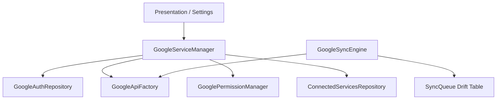

# NeuroFlow — Google Integration Architecture

## 1. Overview
NeuroFlow uses a layered architecture to integrate Google services while maintaining a local-first philosophy. All Google integrations are additive and non-blocking; the application remains fully functional offline.

## 2. Component Responsibilities

### GoogleServiceManager (`lib/platform/google/`)
**Responsibility:** The single orchestrator for the Google ecosystem.
- Exposes a unified API for authentication and permissions.
- Manages the global `GoogleConnectionState`.
- Provides access to specific API clients through the `GoogleApiFactory`.
- Handles silent sign-in and session restoration on startup.

### GoogleAuthRepository (`lib/domain/google/`)
**Responsibility:** Low-level OAuth 2.0 lifecycle management.
- Implementation wraps the `google_sign_in` package.
- Handles `signIn()`, `signOut()`, `signInSilently()`, and `getAuthenticatedClient()`.

### GoogleAccountRepository (`lib/domain/google/`)
**Responsibility:** Manages the identity of the linked Google Account.
- Provides a stream of the current `GoogleAccount`.
- Persists user-specific identifiers securely if needed.

### GooglePermissionManager (`lib/domain/google/`)
**Responsibility:** Granular OAuth scope management.
- Checks if specific scopes (Tasks, Calendar, etc.) are granted.
- Requests incremental scopes from the user without re-authenticating.

### GoogleSyncEngine (`lib/platform/sync/`)
**Responsibility:** A generic synchronization framework.
- Manages a persistent `SyncQueue` of outbound operations.
- Handles retry logic, error reporting, and progress tracking.
- Orchestrates individual `SyncProvider` implementations (e.g., TasksSyncProvider).

### GoogleApiFactory (`lib/platform/google/`)
**Responsibility:** Produces authenticated service clients.
- Wraps the `googleapis` package.
- Ensures requested clients have the required scopes authorized before creation.

### ConnectedServicesRepository (`lib/domain/google/`)
**Responsibility:** Manages the "Enabled" state of individual integrations.
- Tracks which services (Tasks, Calendar, Gemini) the user has opted into.

## 3. Dependency Graph

## 4. Extension Points

### Adding a New Service (e.g., Google Drive)
1. Add necessary scopes to `GooglePermissionManager`.
2. Add a factory method to `GoogleApiFactory`.
3. Create a `DriveSyncProvider` that implements the sync logic.
4. Register the new service in the `ConnectedServicesScreen`.
