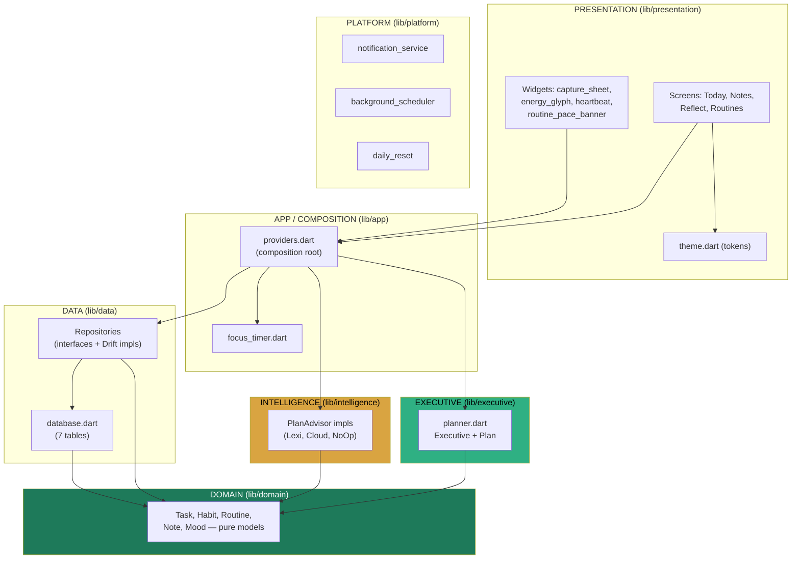
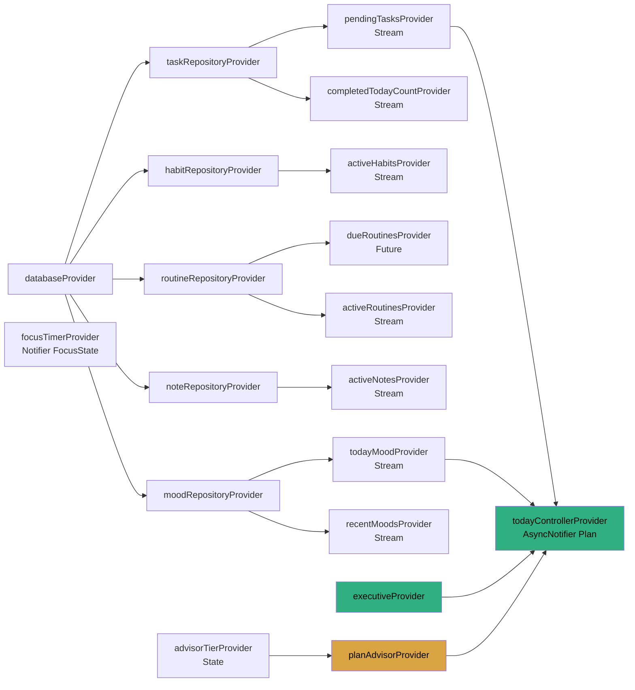
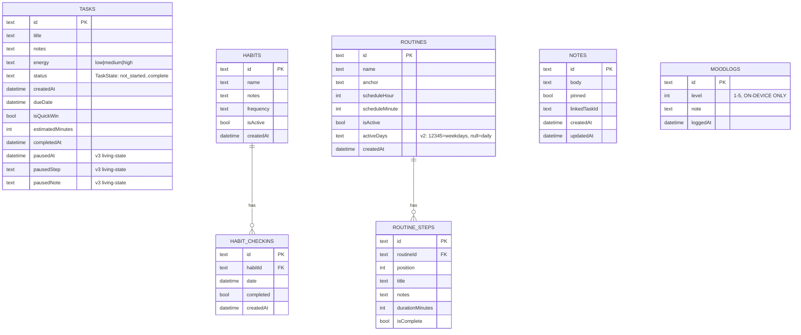
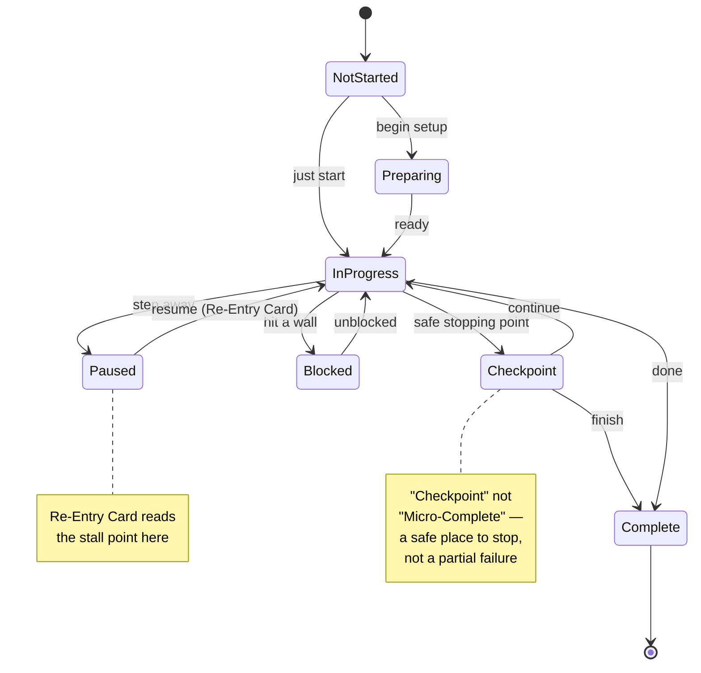
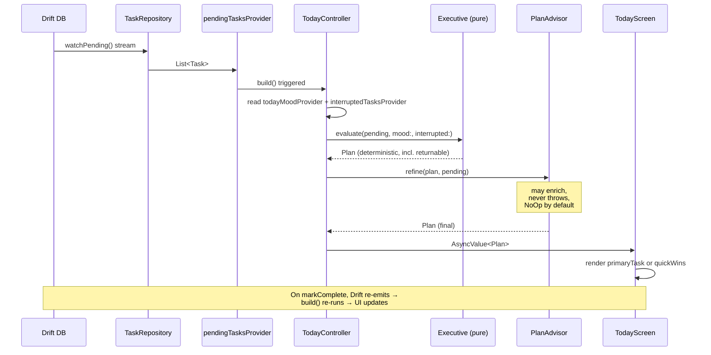
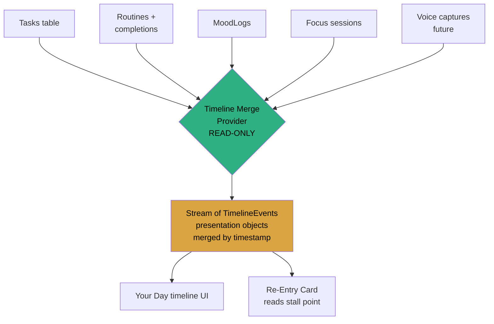

# NeuroFlow — Mermaid Diagrams

*Accurate to the current codebase. Paste any block into a Mermaid renderer (or GitHub markdown) to visualize.*

---

## 1. Overall architecture (layers + dependencies)

---

## 2. Riverpod provider graph

---

## 3. Drift database schema (v3)

---

## 4. Living-State Task flow (BUILT — Phase 2 Step 1)

*Shipped. This 7-state machine (`TaskState` in `lib/domain/task.dart`) replaced the old binary `TaskStatus {pending, completed, skipped}`. Transitions are guarded by `TaskState.allowedNext`; `Task.transitionTo()` keeps pause/complete metadata consistent.*

---

## 5. Today plan generation (the core loop, CURRENT)

---

## 6. Timeline projection (BUILT — Phase 2 Step 2)

*Shipped as `lib/app/timeline.dart` (`timelineProvider`) + `timeline_screen.dart`. A read-only merge, NOT a storage table — nothing writes a TimelineEvent (DEC-004). Current merge inputs: interrupted tasks, completed tasks, mood check-ins, due routines. Focus sessions and voice captures (below) are future layers. The screen isn't wired into nav yet — see TECH_DEBT TD-11.*

> **The rule, restated:** `TimelineEvent` is assembled at READ time. The typed tables stay the source of truth. Nothing writes a TimelineEvent. *Present as events, persist as types.*
